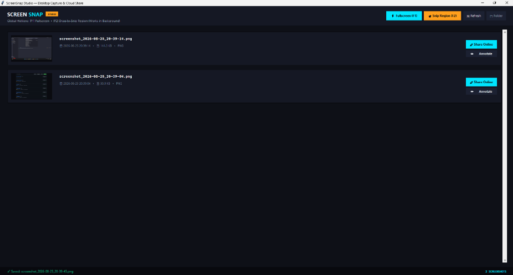
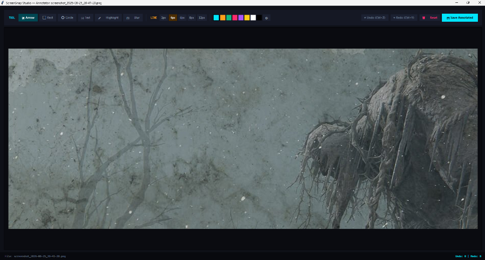
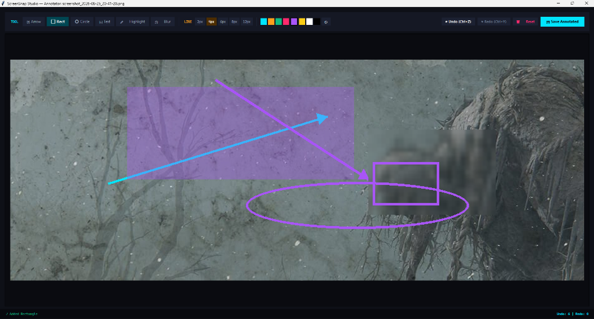

# ScreenSnap Studio - Desktop Screenshot, Annotation and Cloud Share Suite

A modular desktop screenshot application built with Python, Tkinter, Pillow, mss, pynput, requests, and pyperclip.

---

## Application Showcase

### Main Gallery and Capture Hub


### Annotation Studio Interface


### Live Annotations and Editing


---

## Screenshot Directory and Storage

- Auto Initialization: When ScreenSnap Studio starts, it automatically initializes and monitors the dedicated Screenshots folder in the project root.
- Visual Gallery: All existing screenshots are loaded dynamically, sorted by newest first, and presented with thumbnail previews and file details.
- Timestamped Auto Save: Every capture is automatically saved as screenshot_YYYY-MM-DD_HH-MM-SS.png directly into the Screenshots folder.
- Quick Folder Access: Click Open Folder in the header toolbar to view the folder in your operating system file manager.

---

## Key Features

### 1. Global Background Hotkeys
- F1 Fullscreen Capture: Takes an instant fullscreen screenshot anywhere on your system without needing application window focus.
- F2 Interactive Snip Region: Freezes the desktop, dims the surroundings, and lets you drag a rectangular selection box with live pixel dimensions. Releasing the mouse instantly crops and saves the screenshot. Press Esc to cancel.

### 2. Annotation Studio
- Undo Ctrl+Z: Reverts the last annotation step cleanly across all tools.
- Redo Ctrl+Y: Re-applies undone annotations.
- Reset: Discards all edits and reverts to the raw capture.
- Live History Counter: Displays active undo and redo depth in the status bar.
- Annotation Tools: Arrow, Rectangle, Circle, Text Label, Highlight, and Blur / Pixelation.

### 3. Cloud Sharing via tmpfiles.org
- Cloud Upload: Upload any screenshot directly to tmpfiles.org without requiring an account or API key.
- Auto Clipboard Copy: Copies the direct link to the clipboard automatically.
- Share Dialog: Displays the link with options to copy or open directly in a web browser.
- Shared Badge: Marks uploaded screenshot cards for clear status tracking.

---

## Modular Architecture

```
.
├── main.py                     # Application entry point
├── requirements.txt            # Project dependencies
├── README.md                   # Documentation
├── LICENSE                     # Project license
├── Screenshots/                # Output screenshots directory
├── assets/                     # Application preview images
│   ├── gallery_view.png
│   ├── annotator_preview.png
│   └── annotator_drawing.png
│
└── screensnap/                 # Core modular application package
    ├── __init__.py
    ├── config.py               # Theme palette, paths, typography tokens
    ├── app.py                  # Main app controller and UI
    │
    ├── capture/                # Screen capture and hotkeys subsystem
    │   ├── __init__.py
    │   ├── engine.py           # MSS multi-monitor grabber
    │   ├── snipping.py         # Interactive drag to snip overlay
    │   └── hotkeys.py          # Global background hotkey listener
    │
    ├── annotation/             # Image editing and drawing subsystem
    │   ├── __init__.py
    │   ├── engine.py           # Pillow drawing primitives
    │   └── window.py           # Annotator studio with Undo, Redo, and Reset
    │
    ├── cloud/                  # Cloud sharing subsystem
    │   ├── __init__.py
    │   └── uploader.py         # tmpfiles.org async uploader and history tracker
    │
    └── ui/                     # UI components
        ├── __init__.py
        ├── gallery.py          # Scrollable gallery and thumbnail cards
        └── share_modal.py      # Cloud share success modal
```

---

## Quick Start

### 1. Install Dependencies
```bash
pip install -r requirements.txt
```

### 2. Run the Application
```bash
python main.py
```

---

## Shortcuts and Controls

| Shortcut | Context | Action |
| --- | --- | --- |
| F1 | Global Background | Fullscreen Screenshot |
| F2 | Global Background | Interactive Drag to Snip Region |
| Esc | Snipping Overlay | Cancel Snipping |
| F5 | Gallery Window | Refresh Gallery |
| Ctrl + Z | Annotator Window | Undo Annotation |
| Ctrl + Y | Annotator Window | Redo Annotation |
| Ctrl + S | Annotator Window | Save Annotated Image |
| Double Click Card | Gallery Window | Open screenshot in Annotator |
| Right Click Card | Gallery Window | Open context menu |